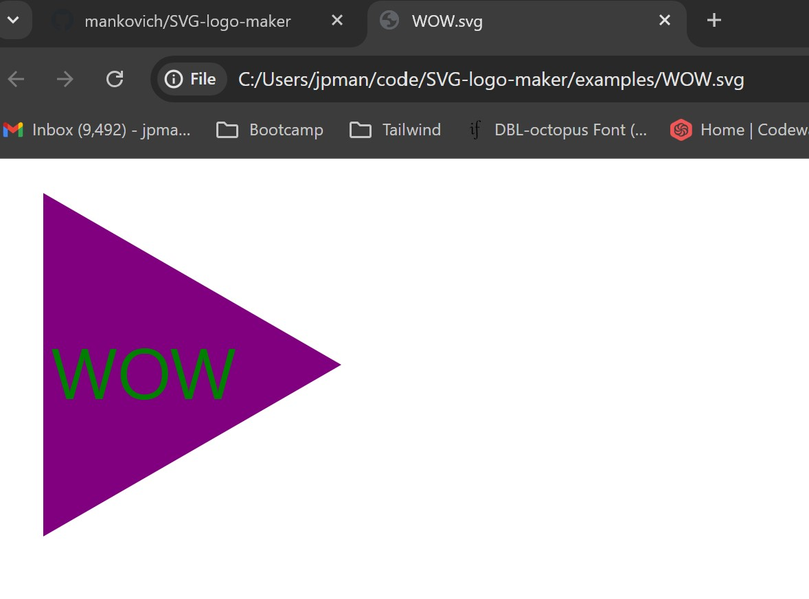

# Module 10 Challenge: SVG Logo Maker

## Description of Application 

This is a simple command-line application run through node.js which employers inquirer to solicit details from the user to generate a simple SVG logo for the user. The user is prompted to: select up to 3 characters to display on the logo, choose between three shapes (circle, triangle, and rectangle) for the logo, and select what color the text will be and what color will fill the logo shape. The application then generates the SVG according to the user's choices and saves it to an .svg file named by the user. 

## Walkthrough Video

My screencapture walkthrough video may be viewed at this Google Drive [link.](https://drive.google.com/file/d/1IAAuOEeOJOIwnPm9uZrf8fbU1aXgWbni/view?usp=sharing)

The video may also be accessed at [my GitHub repository.](https://github.com/mankovich/SVG-logo-maker) 

Finally--and I'm not convinced that I will pull this off successfully--the video itself may be available right here:

## Example SVG logo output

There are a number of examples of SVGs generated by the application in my repository. The following is a screenshot of the SVG generated during the walkthrough video: 

---

&copy;2024 Mankovich, a person. All rights reserved. 